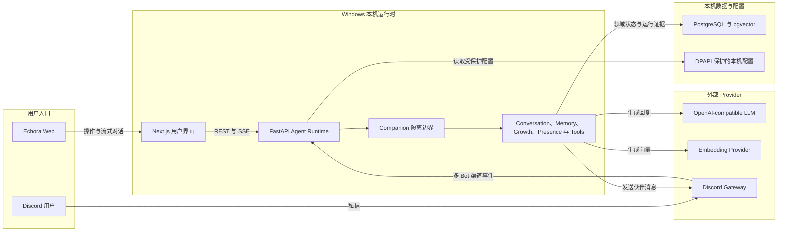

# Echora

**一位能够记住你、理解你，并与你共同成长的长期 AI 伙伴。**

Echora 是一个本机运行的 multi-Companion AI Agent。它把长期记忆、可成长人格、双向存在感、工具执行和 Discord 陪伴组合在一起，让不同伙伴拥有彼此隔离的身份、关系、记忆与行为方式。

从创建伙伴开始，你可以在 Web 中持续对话、整理共同记忆、观察关系成长、配置工具与陪伴节奏，也可以把每位伙伴连接到独立的 Discord Bot，让同一段关系在 Web 与 Discord 私信之间延续。

## 可以体验什么

- **长期伙伴与差异化人格**：创建多位伙伴，编辑身份、关系、沟通风格、性格与相处方式；档案会进入真实 Agent 上下文。
- **沉浸式对话**：流式回复、上下文记忆、消息操作、工具活动与可审计的高层运行依据。
- **可管理的记忆**：查看、补充、更正、遗忘伙伴记忆，并保持每位伙伴的私有边界。
- **成长与 Presence**：查看伙伴理解与沟通方式的变化，管理主动陪伴、安静时段、专注模式和有意义的沉默。
- **真实工具运行**：按伙伴配置工具与授权策略，保留执行结果、失败反馈和必要证据。
- **Discord 多 Bot 陪伴**：为不同伙伴配置独立 Bot，通过首次私信建立持久 Conversation，并在 Web 与 Discord 之间延续同一段对话。
- **本机可视化配置**：在前端安全配置 PostgreSQL、LLM、Embedding 和 Discord 凭据；秘密值不会回显。
- **完整数据权利**：导出伙伴数据、在 30 天恢复窗口内删除或恢复伙伴，并可在二次确认后永久删除伙伴或已归档 Conversation。

## 技术结构



每位 Companion 的身份、人格、关系、私有记忆、Presence 策略和渠道身份均在 Agent Runtime 内保持隔离，Web 与 Discord 共享持久 Conversation，但不会混合不同伙伴的数据。

```text
Echora/
├── apps/web/                 # Next.js 16 + React 19 用户界面
├── services/agent-api/       # FastAPI + SQLAlchemy Agent API
├── packages/shared-types/    # 共享 TypeScript 契约
└── scripts/                  # Windows PowerShell 开发脚本
```

核心运行依赖：

- Node.js 20+ 与 npm
- Python 3.12+ 与 [uv](https://docs.astral.sh/uv/)
- PostgreSQL 与 pgvector
- OpenAI-compatible LLM API
- Embedding Provider
- Discord Application（仅在使用 Discord 时需要）

## 本机启动

### 1. 准备配置

```powershell
Copy-Item .env.example .env
.\scripts\check-env.ps1
```

编辑 `.env`，至少完成 PostgreSQL、LLM 与 Embedding 配置。也可以在首次启动后通过 `/settings/system/providers` 使用本机安全配置界面完成这些设置。

### 2. 安装依赖

```powershell
Set-Location apps\web
npm ci

Set-Location ..\..\services\agent-api
uv sync --frozen

Set-Location ..\..
```

### 3. 初始化数据库

```powershell
.\scripts\migrate.ps1 upgrade
.\scripts\seed.ps1
```

### 4. 启动

```powershell
.\scripts\start-dev.ps1
```

- Web：<http://localhost:3000>
- Agent API：<http://127.0.0.1:8010>
- API 文档：<http://127.0.0.1:8010/docs>

### 5. 完成首次体验

1. 打开首页，选择 Single Companion 并创建第一位伙伴。
2. 在伙伴档案中设置名字、关系、人格、沟通方式和回复偏好。
3. 创建 Conversation 并发送第一条消息。
4. 前往“设置 → 模型与连接”测试数据库、LLM 与 Embedding。
5. 前往“设置 → 工具”检查当前伙伴可使用的工具与确认策略。
6. 如需 Discord，继续完成下方的 Discord Bot 配置与 Runtime 启动。

停止当前仓库启动的服务：

```powershell
.\scripts\stop-dev.ps1
```

## Discord 陪伴配置

### 1. 在 Discord 创建 Bot

1. 打开 [Discord Developer Portal](https://discord.com/developers/applications)，选择 **New Application** 创建应用。
2. 进入 **Bot** 页面创建 Bot，使用 **Reset Token** 获取 Bot Token。Token 只在下一步填写到 Echora，不要写入 README、提交到 Git，或发送给其他人。
3. 在 **Privileged Gateway Intents** 中启用 **Message Content Intent**，使 Runtime 能读取私信与被授权频道中的消息内容。
4. 在 **General Information** 记录 **Application ID** 与 **Public Key**。
5. 在 OAuth2 中使用 `bot` 与 `applications.commands` scopes 将 Bot 邀请到一个与你共享的服务器。仅使用私信时无需额外频道权限；如需体验服务器频道或聊天室，请授予目标频道的 View Channels、Send Messages 与 Read Message History 权限。

Discord Client Secret 对标准 Bot 邀请与 DM Gateway 不必填写；它只用于单独的 OAuth2 authorization-code exchange。

### 2. 在 Echora 添加并绑定 Bot

1. 先运行 `.\scripts\start-dev.ps1`，打开 <http://localhost:3000/settings/system/providers>。
2. 在 Discord 区域选择“添加 Bot”，填写唯一的 Bot key、显示名称、Application ID、Public Key 与 Bot Token。Guild ID、默认 Channel ID 仅在需要固定服务器或频道时填写。
3. 保存配置后选择“测试 Bot”。测试会向 Discord 验证 Token；受保护的 Token 不会回显。
4. 打开 <http://localhost:3000/settings/channels/discord>，为该 Bot 选择一位 Companion 并保存绑定。每个 Bot 同一时间只绑定一位 Companion。

通过前端保存后，Echora 会自动生成本机运行配置，并使用 Windows DPAPI 保护秘密值；不需要手工创建或提交 `.secrets/`。

### 3. 启动 Discord Runtime

`start-dev.ps1` 不会自动启动 Discord Gateway。请保留 Web 与 Agent API 运行，并另开一个 PowerShell 窗口：

```powershell
Set-Location services\agent-api
uv run python scripts/run_discord_runtime.py
```

Runtime 会加载所有已启用且已配置 Token 的 Bot，连接 Discord Gateway，并在配置了 Application ID 时注册 `/echora-binding` 与 `/echora-room` 命令。保持该窗口运行；需要停止时按 `Ctrl+C`。

### 4. 开始 Discord 私信

使用与 Bot 共享服务器且允许私信的 Discord 账号向 Bot 发送第一条消息。首次 DM 会锁定 Discord identity，并为已绑定的 Companion 创建持久 Web Conversation；后续消息和回复会继续写入同一段对话，也可以在“设置 → Discord”中切换、新建、暂停或撤销绑定。

## 验证

前端：

```powershell
Set-Location apps\web
npm run lint
npx tsc --noEmit
npm run build
npm run check:product-contract
```

后端：

```powershell
Set-Location services\agent-api
$env:PYTHONPATH='.'
uv run pytest -q
```

公开候选边界与产品语言：

```powershell
Set-Location ..\..
.\scripts\check-public-release.ps1
.\scripts\check-public-language.ps1
```

## 安全与数据

- 不要提交 `.env`、`.secrets/`、`*.local.json`、本地日志、备份或 QA 产物。
- Discord token、模型 API key 与数据库连接只保存在本机受保护配置或环境变量中，API 不返回秘密原文。
- 不同 Companion 的身份、人格、记忆与 Discord Bot 绑定相互隔离；Bot 改绑会先显示影响并要求确认。

## 许可证

Copyright 2026 Lelov。Echora 基于 [Apache License 2.0](LICENSE) 开源。
