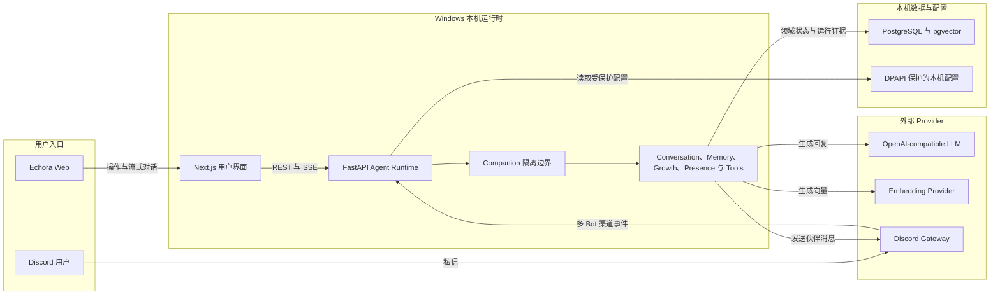

# Echora

**一位能够记住你、理解你，并与你共同成长的长期 AI 伙伴。**

Echora 是一个本机运行的 multi-Companion AI Agent。它把长期记忆、可成长人格、双向存在感、工具执行和 Discord 陪伴组合在一起，让不同伙伴拥有彼此隔离的身份、关系、记忆与行为方式。

Echora 不是角色卡展示器，也不是只读的 Agent 监控后台。用户可以管理伙伴档案、修正记忆、理解成长、配置主动陪伴节奏、控制工具权限，并决定不同渠道中的相处方式。

## 当前可体验能力

- **长期伙伴与差异化人格**：创建多位伙伴，编辑身份、关系、沟通风格、性格与相处方式；档案会进入真实 Agent 上下文。
- **沉浸式对话**：流式回复、上下文记忆、消息操作、工具活动与可审计的高层运行依据。
- **可管理的记忆**：查看、补充、更正、遗忘伙伴记忆，并保持每位伙伴的私有边界。
- **成长与 Presence**：查看伙伴理解与沟通方式的变化，管理主动陪伴、安静时段、专注模式和有意义的沉默。
- **真实工具运行**：按伙伴配置工具与授权策略，保留执行结果、失败反馈和必要证据。
- **Discord 多 Bot 陪伴**：配置 Bot、伙伴和 Conversation 的持久 DM 绑定。
- **本机可视化配置**：在前端安全配置 PostgreSQL、LLM、Embedding 和 Discord 凭据；秘密值不会回显。
- **完整数据权利**：导出伙伴数据、在 30 天恢复窗口内删除或恢复伙伴，并可在二次确认后永久删除伙伴或已归档 Conversation。

## 诚实的能力边界

- Memory reranker 与 Presence learned policy 默认采用稳定评估模式；Assistive 受 readiness gate 约束，Active 尚未授权。
- 伙伴删除默认提供 30 天恢复窗口；立即永久删除以及已归档 Conversation 的永久删除均要求影响预检与明确二次确认。
- Voice、WebRTC、LiveKit、Avatar 与 Live2D 尚未作为可用产品能力交付。
- 当前面向 Windows 本机单用户体验，不以公网部署或多租户服务为目标。

## 技术结构



每位 Companion 的身份、人格、关系、私有记忆、Presence 策略和渠道身份均在 Agent Runtime 内保持隔离。Shared、channel 与 realtime memory 默认经过 review gate；Hard Stop、revoke、quiet hours、focus mode 和 meaningful silence 始终优先于主动行为。

```text
Echora/
├── apps/web/                 # Next.js 16 + React 19 用户界面
├── services/agent-api/       # FastAPI + SQLAlchemy Agent API
├── packages/shared-types/    # 共享 TypeScript 契约
└── scripts/                  # Windows PowerShell 开发脚本
```

核心运行依赖：

- Node.js 20+ 与 npm
- Python 3.12+ 与 [uv](https://docs.astral.sh/uv/)
- PostgreSQL 与 pgvector
- OpenAI-compatible LLM API
- Embedding Provider
- Discord Application（仅在使用 Discord 时需要）

## 本机启动

### 1. 准备配置

```powershell
Copy-Item .env.example .env
.\scripts\check-env.ps1
```

编辑 `.env`，至少完成 PostgreSQL、LLM 与 Embedding 配置。也可以在首次启动后通过 `/settings/system/providers` 使用本机安全配置界面完成这些设置。

### 2. 安装依赖

```powershell
Set-Location apps\web
npm ci

Set-Location ..\..\services\agent-api
uv sync --frozen

Set-Location ..\..
```

### 3. 初始化数据库

```powershell
.\scripts\migrate.ps1 upgrade
.\scripts\seed.ps1
```

### 4. 启动

```powershell
.\scripts\start-dev.ps1
```

- Web：<http://localhost:3000>
- Agent API：<http://127.0.0.1:8010>
- API 文档：<http://127.0.0.1:8010/docs>

### 5. 完成首次体验

1. 打开首页，选择 Single Companion 并创建第一位伙伴。
2. 在伙伴档案中设置名字、关系、人格、沟通方式和回复偏好。
3. 创建 Conversation 并发送第一条消息。
4. 前往“设置 → 模型与连接”测试数据库、LLM 与 Embedding。
5. 前往“设置 → 工具”检查当前伙伴可使用的工具与确认策略。
6. 如需 Discord，在“设置 → Discord”配置 Bot，并在 Discord 私信后建立持久 Conversation。

停止当前仓库启动的服务：

```powershell
.\scripts\stop-dev.ps1
```

## 验证

前端：

```powershell
Set-Location apps\web
npm run lint
npx tsc --noEmit
npm run build
npm run check:product-contract
```

后端：

```powershell
Set-Location services\agent-api
$env:PYTHONPATH='.'
uv run pytest -q
```

公开候选边界与产品语言：

```powershell
Set-Location ..\..
.\scripts\check-public-release.ps1
.\scripts\check-public-language.ps1
```

## 安全与数据

- 不要提交 `.env`、`.secrets/`、`*.local.json`、本地日志、备份或 QA 产物。
- Discord token、模型 API key 与数据库连接只保存在本机受保护配置或环境变量中，API 不返回秘密原文。
- 多伙伴数据默认隔离；Shared、channel 与 realtime memory 保持 review gate。
- Hard stop、revoke、quiet hours、focus mode 与 meaningful silence 不能被普通自动化开关绕过。

## 项目状态

Echora 仍在持续开发。公开仓库只保留产品代码、必要测试、示例配置与外部开发说明；内部计划、进度记录、历史截图和个人开发材料不属于公开发布内容。

## 许可证

Copyright 2026 Lelov。Echora 基于 [Apache License 2.0](LICENSE) 开源。
